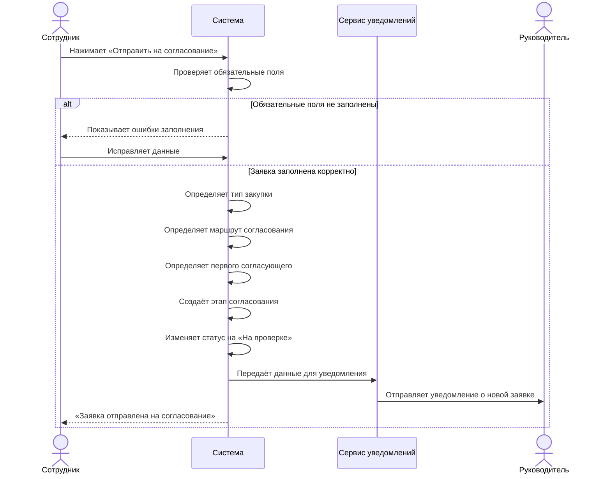

# Sequence Diagram

## Логика построения

Для диаграммы выбран сценарий **«Отправка заявки на согласование»**, так как он отражает один из основных процессов системы.

## Диаграмма последовательности

---

