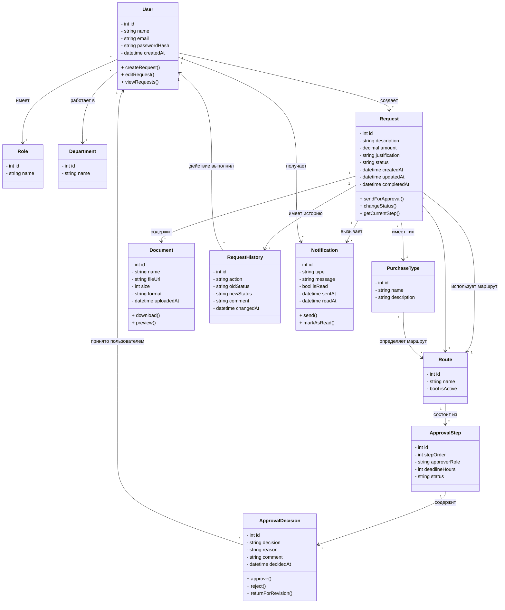

# Class Diagram

---

## Описание основных классов

### User

Пользователь системы. Может создавать и редактировать собственные заявки, а также просматривать доступные ему заявки.

### Role

Роль пользователя в системе, определяющая доступные ему действия.

### Department

Подразделение, к которому относится пользователь.

### Request

Основная сущность системы — закупочная заявка. Содержит информацию о закупке, её текущем статусе и датах обработки.

### PurchaseType

Тип закупки. Используется для определения маршрута согласования.

В проекте предусмотрены следующие типы:

- Простая;
- IT;
- Юридическая.

### Document

Документ, прикреплённый к закупочной заявке.

### RequestHistory

История действий с заявкой. Сохраняет информацию об изменениях статуса, выполненном действии, пользователе, комментарии и времени изменения.

### Route

Маршрут согласования, который определяется типом закупки и состоит из последовательности этапов.

### ApprovalStep

Отдельный этап маршрута согласования. Определяет порядок этапа, роль согласующего и установленный срок обработки.

### ApprovalDecision

Решение, принятое согласующим на конкретном этапе. Возможные решения: согласование, отклонение или возврат на доработку.

### Notification

Уведомление пользователя о событиях, связанных с заявкой.

---

