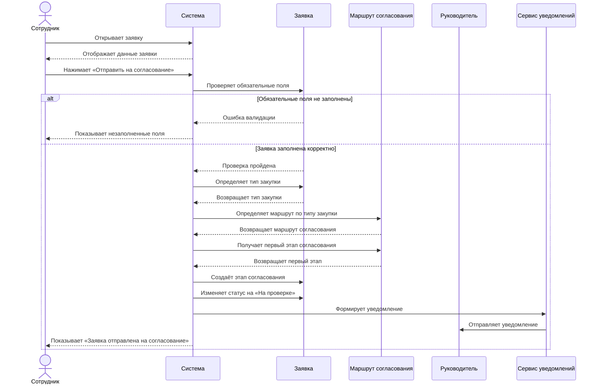

# Sequence Diagram

## Логика построения

Для диаграммы выбран сценарий **«Отправка заявки на согласование»**, так как в нём задействована основная логика системы

```mermaid
sequenceDiagram
    actor Employee as Сотрудник
    participant System as Система
    participant Request as Заявка
    participant Route as Маршрут согласования
    participant Manager as Руководитель
    participant Notification as Сервис уведомлений

    Employee->>System: Открывает заявку
    System-->>Employee: Отображает данные заявки

    Employee->>System: Нажимает «Отправить на согласование»

    System->>Request: Проверяет обязательные поля

    alt Обязательные поля не заполнены
        Request-->>System: Ошибка валидации
        System-->>Employee: Показывает незаполненные поля
    else Заявка заполнена корректно
        Request-->>System: Проверка пройдена

        System->>Request: Определяет тип закупки
        Request-->>System: Возвращает тип закупки

        System->>Route: Определяет маршрут по типу закупки
        Route-->>System: Возвращает маршрут согласования

        System->>Route: Получает первый этап согласования
        Route-->>System: Возвращает первый этап

        System->>Request: Создаёт этап согласования
        System->>Request: Изменяет статус на «На проверке»

        System->>Notification: Формирует уведомление
        Notification->>Manager: Отправляет уведомление

        System-->>Employee: Показывает «Заявка отправлена на согласование»
    end
```

---
