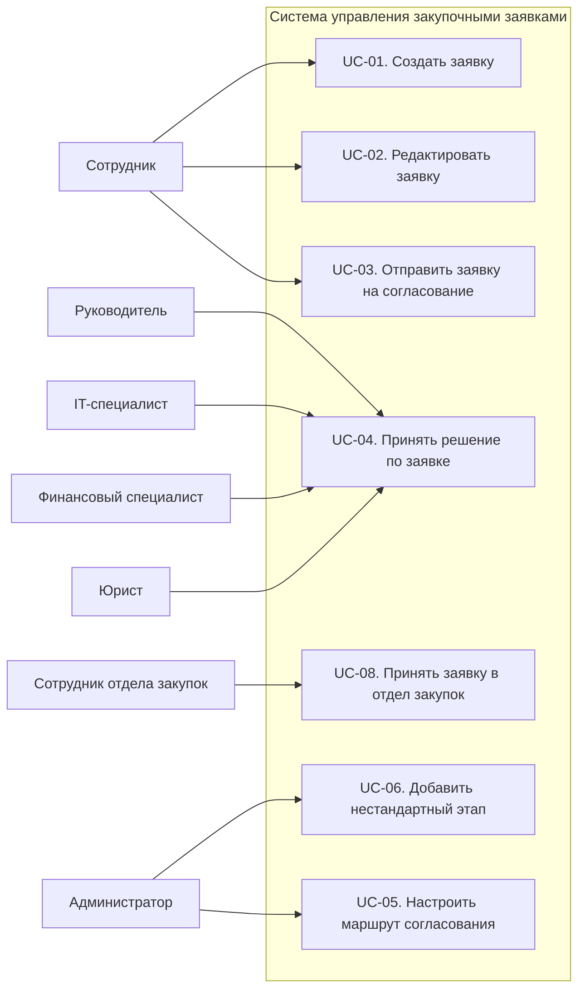

# Диаграмма вариантов использования

```mermaid
graph LR

    Employee["Сотрудник"]
    Manager["Руководитель"]
    IT["IT-специалист"]
    Finance["Финансовый специалист"]
    Legal["Юрист"]
    Purchasing["Сотрудник отдела закупок"]
    Admin["Администратор"]

    subgraph System["Система управления закупочными заявками"]

        UC1["UC-01. Создать заявку"]
        UC2["UC-02. Редактировать заявку"]
        UC3["UC-03. Отправить заявку на согласование"]

        UC4["UC-04. Принять решение по заявке"]

        UC5["UC-06. Добавить нестандартный этап"]

        UC6["UC-08. Принять заявку в отдел закупок"]

        UC7["UC-05. Настроить маршрут согласования"]

    end

    Employee --> UC1
    Employee --> UC2
    Employee --> UC3

    Manager --> UC4
    IT --> UC4
    Finance --> UC4
    Legal --> UC4

    Admin --> UC5
    Admin --> UC7

    Purchasing --> UC6
```
