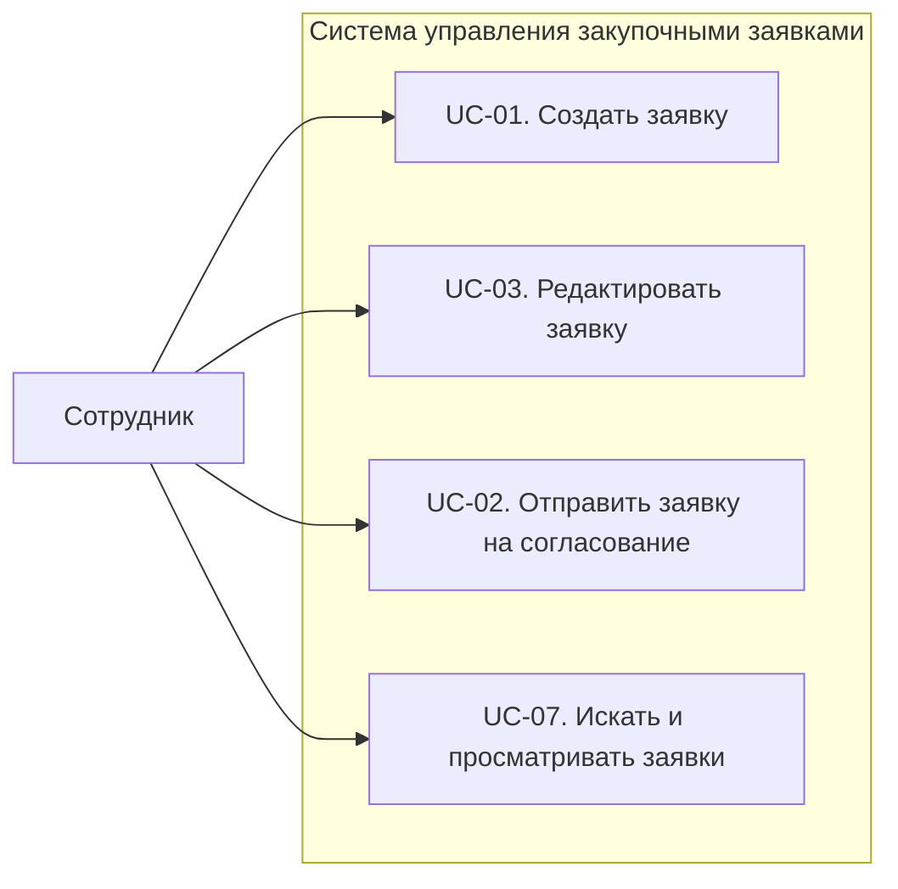
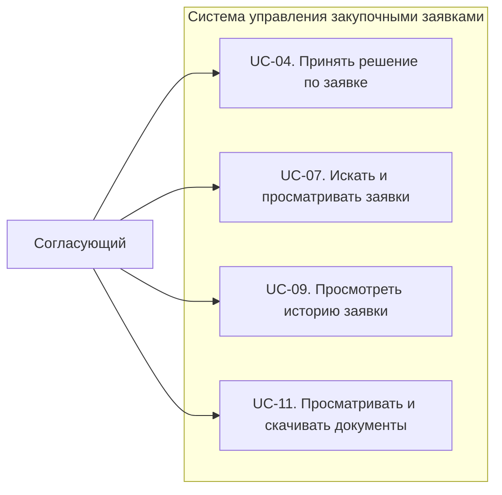
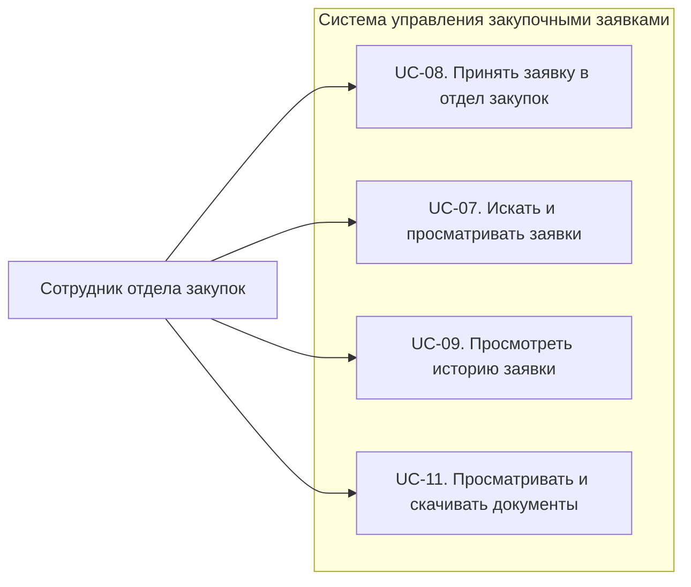
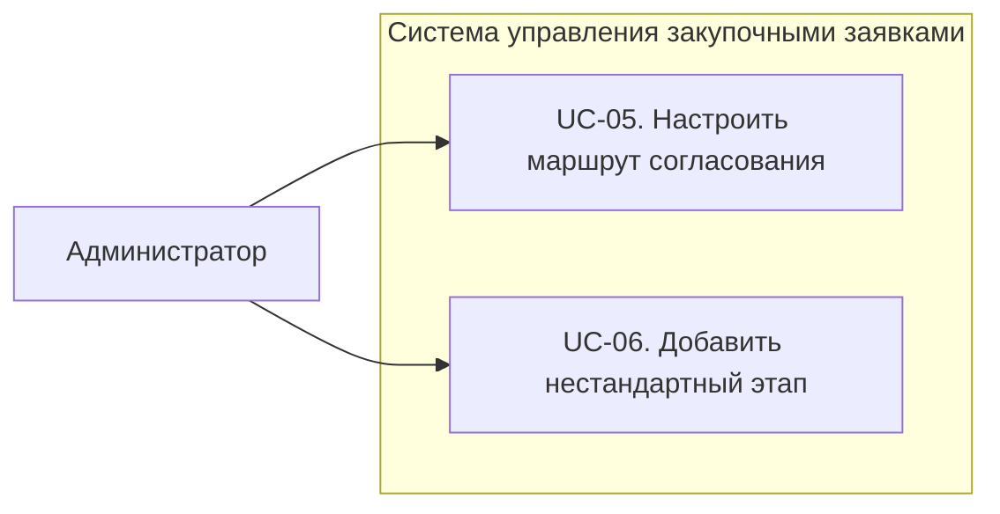

# Use Case Diagram

## Логика построения

Полную модель вариантов использования мы не объединяем в одну диаграмму, так как в системе несколько ролей пользователей и большое количество сценариев. При отображении всех связей на одной схеме диаграмма становится перегруженной и плохо читаемой.

Поэтому варианты использования разделены на четыре диаграммы по основным ролям пользователей:

1. **Действия сотрудника** — создание и отправка закупочной заявки.
2. **Действия согласующих** — проверка и принятие решения по заявке.
3. **Действия отдела закупок** — работа с согласованными заявками.
4. **Действия администратора** — настройка маршрутов и обработка нестандартных случаев.

В диаграмме согласующих руководитель, IT-специалист, финансовый специалист и юрист объединены в общего актора **«Согласующий»**, поскольку с точки зрения системы они выполняют один и тот же основной сценарий — принимают решение по заявке.

---

## Диаграмма 1. Действия сотрудника

Сотрудник создаёт закупочную заявку, при необходимости редактирует её и отправляет на согласование.

---

## Диаграмма 2. Действия согласующих

Руководитель, IT-специалист, финансовый специалист и юрист рассматриваются как согласующие. Они используют общий набор функций для проверки и обработки заявок.

**Состав роли «Согласующий»:**
- Руководитель;
- IT-специалист;
- Финансовый специалист;
- Юрист.

---

## Диаграмма 3. Действия отдела закупок

После завершения согласования сотрудник отдела закупок принимает заявку и получает доступ к необходимой информации для дальнейшей работы.

---

## Диаграмма 4. Действия администратора

Администратор управляет настройками маршрутов согласования и может добавлять дополнительные этапы для отдельных заявок.

---

