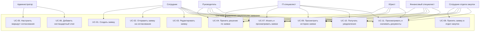

```mermaid
graph TB

    Employee["Сотрудник"]
    Manager["Руководитель"]
    IT["IT-специалист"]
    Finance["Финансовый специалист"]
    Legal["Юрист"]
    Purchasing["Сотрудник отдела закупок"]
    Admin["Администратор"]

    subgraph System["Система управления закупочными заявками"]

        direction TB

        UC1["UC-01. Создать заявку"]
        UC2["UC-02. Отправить заявку на согласование"]
        UC3["UC-03. Редактировать заявку"]

        UC4["UC-04. Принять решение по заявке"]

        UC5["UC-05. Настроить маршрут согласования"]
        UC6["UC-06. Добавить нестандартный этап"]

        UC7["UC-07. Искать и просматривать заявки"]
        UC8["UC-08. Принять заявку в отдел закупок"]
        UC9["UC-09. Просмотреть историю заявки"]
        UC10["UC-10. Получать уведомления"]
        UC11["UC-11. Просматривать и скачивать документы"]

    end

    Employee --> UC1
    Employee --> UC2
    Employee --> UC3

    Manager --> UC4
    IT --> UC4
    Finance --> UC4
    Legal --> UC4

    Purchasing --> UC8

    Admin --> UC5
    Admin --> UC6

    Employee --> UC7
    Manager --> UC7
    IT --> UC7
    Finance --> UC7
    Legal --> UC7
    Purchasing --> UC7

    Employee --> UC9
    Manager --> UC9
    IT --> UC9
    Finance --> UC9
    Legal --> UC9
    Purchasing --> UC9

    Employee --> UC10
    Manager --> UC10
    IT --> UC10
    Finance --> UC10
    Purchasing --> UC10

    Employee --> UC11
    Manager --> UC11
    IT --> UC11
    Finance --> UC11
    Legal --> UC11
    Purchasing --> UC11
```
